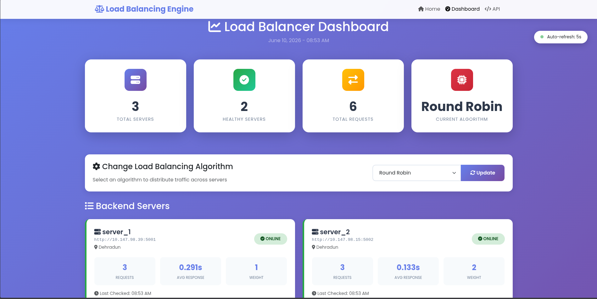
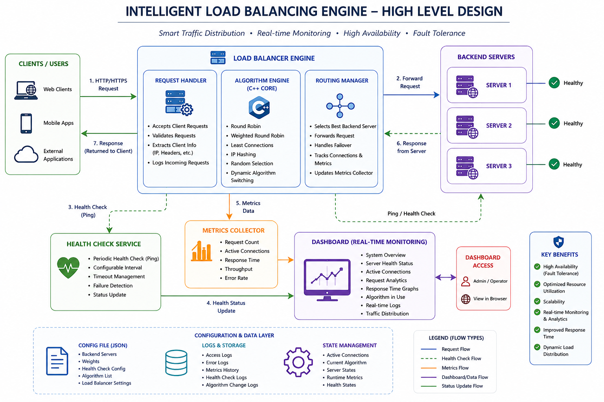

# Intelligent Load Balancing Engine

<p align="center">
  
</p>

## Overview

The Intelligent Load Balancing Engine is a distributed systems project designed to simulate and implement real-world traffic distribution techniques used in cloud computing, enterprise infrastructure, content delivery platforms, and large-scale web applications.

The system intelligently distributes incoming client requests across multiple backend servers using classical Design and Analysis of Algorithms (DAA) concepts combined with modern distributed architecture principles.

Unlike traditional academic simulations, this project provides a practical implementation of:

* Dynamic request routing
* Multi-server load balancing
* Server health monitoring
* Traffic optimization
* Performance analytics
* Real-time dashboard visualization
* Fault tolerance mechanisms
* Hybrid Python + C++ architecture

The project demonstrates how modern systems such as cloud platforms, reverse proxies, API gateways, and distributed application infrastructures manage traffic efficiently while maintaining high availability and reliability.

# Problem Statement

Modern applications receive thousands or millions of requests from users simultaneously.

Without intelligent traffic distribution:

* Some servers become overloaded
* Response times increase
* System availability decreases
* Resource utilization becomes inefficient
* Single points of failure emerge

Organizations require scalable systems that can:

* Distribute traffic fairly
* Detect unhealthy servers
* Redirect requests automatically
* Improve throughput
* Maintain consistent user experience

This project addresses these challenges by implementing multiple load balancing strategies and continuously monitoring backend server health.


# Real-World Applications

## Cloud Infrastructure

* AWS Elastic Load Balancer
* Google Cloud Load Balancing
* Microsoft Azure Load Balancer

## Enterprise Applications

* Banking systems
* ERP platforms
* CRM systems

## E-Commerce Platforms

* Amazon
* Flipkart
* Shopify-based stores

## API Gateways

* Microservice architectures
* Service mesh environments

## Content Delivery Systems

* Media streaming platforms
* Video distribution networks

## SaaS Applications

* Multi-tenant platforms
* Customer-facing web services

## Data Centers

* Internal service routing
* Resource optimization

# Key Features

### Intelligent Traffic Distribution

Supports multiple load balancing algorithms:

* Round Robin
* Weighted Round Robin
* Least Connections
* IP Hashing
* Random Selection

### Hybrid Python + C++ Architecture

* Python handles networking and orchestration
* C++ executes algorithmic computations
* Improves execution efficiency
* Demonstrates language interoperability

### Dynamic Health Monitoring

* Periodic server health checks
* Automatic failure detection
* Fault-tolerant request routing
* Real-time availability updates

### Real-Time Dashboard

Displays:

* Active algorithm
* Server health status
* Active connections
* Request count
* Response time statistics
* Traffic distribution metrics

### Dynamic Algorithm Switching

Administrators can switch routing algorithms during runtime without restarting the system.

### Metrics Collection

Tracks:

* Request volume
* Average response time
* Active connections
* Healthy servers
* Load distribution efficiency

### JSON-Based Configuration

Backend servers can be added or modified without changing application logic.


# Impact and Benefits

The Intelligent Load Balancing Engine helps improve infrastructure efficiency and service availability.

| Area                                | Estimated Improvement |
| ----------------------------------- | --------------------- |
| Server Resource Utilization         | Up to 35%             |
| Traffic Distribution Efficiency     | Up to 40%             |
| Response Time Consistency           | Up to 30%             |
| Failure Recovery Speed              | Up to 60%             |
| Infrastructure Reliability          | Up to 45%             |
| Manual Traffic Management Reduction | Up to 70%             |
| High Availability Readiness         | Up to 50%             |

Note: Actual results depend on infrastructure size, workload patterns, network latency, and deployment environment.


# System Architecture
<p align="center">
  
</p>

# Project Structure

```text
├── algorithm
    ├── algo_logic.cpp
|
├── backend
    ├── backend.py
|
├── config
    ├── server_config.json
|
├── images
    ├── dashboard.png
    ├── hld.png
|
├── load_balancer
    ├── load_balancer.py
|
├── templates
    ├── dashboard.html
|
├── LICENSE
├── README.md
```

# Load Balancing Algorithms

## 1. Round Robin

Requests are distributed sequentially among all healthy servers.

### Characteristics

* Simple implementation
* Equal traffic distribution
* Suitable when all servers have similar capacity

### Complexity

| Metric           | Value               |
| ---------------- | ------------------- |
| Time Complexity  | O(1)                |
| Space Complexity | O(1)                |
| Paradigm         | Cyclic Scheduling   |
| Data Structure   | Array / Vector      |
| Approach         | Sequential Rotation |


## 2. Weighted Round Robin

Servers receive traffic proportional to assigned weights.

### Example

Server A → Weight 1

Server B → Weight 3

Traffic Distribution:

```text
A B B B A B B B
```

### Complexity

| Metric           | Value                 |
| ---------------- | --------------------- |
| Time Complexity  | O(1)                  |
| Space Complexity | O(W)                  |
| Paradigm         | Weighted Scheduling   |
| Data Structure   | Weighted List         |
| Approach         | Weight-Based Rotation |

Where W = Sum of all server weights.


## 3. Least Connections

Traffic is routed to the server with the minimum active connections.

### Characteristics

* Dynamic balancing
* Adapts to workload variations
* Suitable for long-running requests

### Complexity

| Metric           | Value             |
| ---------------- | ----------------- |
| Time Complexity  | O(N)              |
| Space Complexity | O(1)              |
| Paradigm         | Greedy            |
| Data Structure   | Array             |
| Approach         | Minimum Selection |

Where N = Number of Servers


## 4. IP Hashing

Client IP determines server assignment.

### Characteristics

* Session persistence
* Consistent routing
* Better user affinity

### Complexity

| Metric           | Value                 |
| ---------------- | --------------------- |
| Time Complexity  | O(L)                  |
| Space Complexity | O(1)                  |
| Paradigm         | Hashing               |
| Data Structure   | Hash Function         |
| Approach         | Deterministic Mapping |

Where L = Length of IP Address


## 5. Random Selection

A healthy server is selected randomly.

### Characteristics

* Extremely lightweight
* Fast routing
* Simple implementation

### Complexity

| Metric           | Value                |
| ---------------- | -------------------- |
| Time Complexity  | O(N)                 |
| Space Complexity | O(N)                 |
| Paradigm         | Probabilistic        |
| Data Structure   | List                 |
| Approach         | Randomized Selection |


# Technologies Used

## Backend

* Python
* Flask
* Requests

## Algorithm Engine

* C++

## Frontend

* HTML
* CSS
* Bootstrap
* JavaScript

## Configuration

* JSON

## Networking

* REST APIs
* HTTP Communication

## Concurrency

* Multithreading
* Thread Synchronization


# Working Principle

1. Client sends request to Load Balancer.
2. Load Balancer checks current algorithm.
3. Server health status is verified.
4. Appropriate backend server is selected.
5. Request is forwarded.
6. Backend server processes request.
7. Response is returned to client.
8. Metrics are recorded.
9. Dashboard updates in real time.
10. Health monitor continuously validates server availability.


# Deployment Guide

## Clone Repository

```bash
git clone https://github.com/yourusername/intelligent-load-balancing-engine.git

cd intelligent-load-balancing-engine
```

## Install Dependencies

```bash
pip install flask requests
```

## Compile C++ Algorithm Engine

Linux

```bash
g++ algorithms/algo_logic.cpp -o algorithms/algo_logic
```

Windows

```bash
g++ algorithms/algo_logic.cpp -o algorithms/algo_logic.exe
```

## Configure Backend Servers

Update:

```json
config/server_config.json
```

Example:

```json
{
  "backend_servers": [
    {
      "id": "server_1",
      "url": "http://localhost:5001",
      "weight": 1
    }
  ]
}
```


## Start Backend Servers

```bash
python backend/backend_server.py
```


## Start Load Balancer

```bash
python load_balancer/load_balancer.py
```

## Access Dashboard

```text
http://localhost:8000/dashboard
```


# Monitoring Capabilities

The dashboard provides:

* Server availability tracking
* Health monitoring
* Active connection count
* Total request count
* Average response time
* Current routing algorithm
* Infrastructure statistics


# Future Enhancements

* AI-based traffic prediction
* Machine learning workload analysis
* Auto-scaling integration
* Kubernetes deployment
* Docker containerization
* Consistent hashing
* Geo-location aware routing
* Adaptive weighted balancing
* Distributed logging pipeline
* Prometheus & Grafana integration


# Learning Outcomes

This project provides practical experience in:

* Design and Analysis of Algorithms
* Distributed Systems
* Computer Networks
* Load Balancing Techniques
* Cloud Computing Concepts
* System Architecture
* Concurrent Programming
* Fault Tolerance
* Performance Engineering
* Infrastructure Monitoring


# Conclusion

The Intelligent Load Balancing Engine demonstrates how algorithmic concepts from DAA can be applied to solve real-world distributed systems challenges. By combining multiple load balancing strategies, health monitoring, performance analytics, and a hybrid Python + C++ architecture, the system simulates the foundational principles used in modern cloud platforms, enterprise infrastructures, and large-scale web services.

# License

This project is open-source and available under the MIT License.
